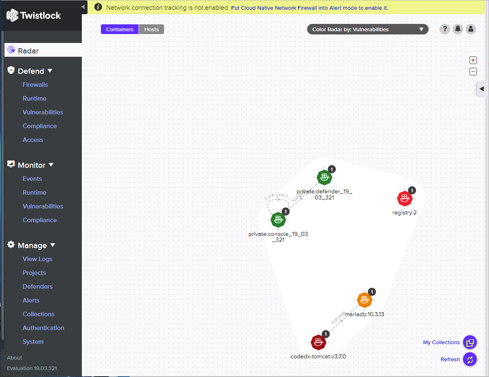
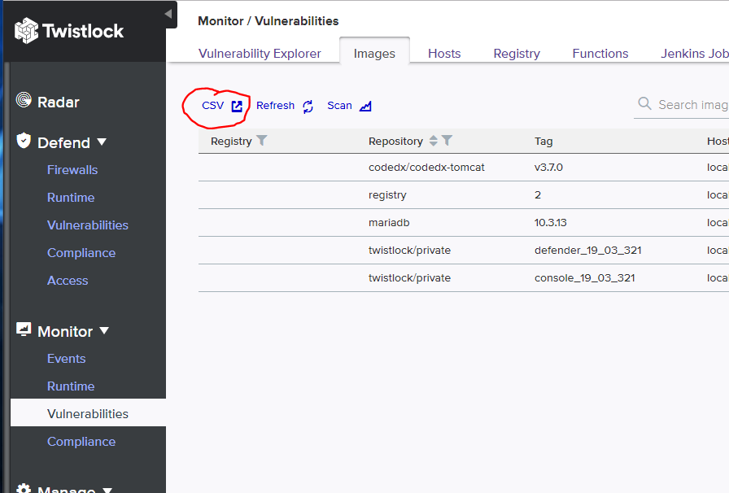

# Twistlock Converter

This converter takes a list of CSV files from Twistlock findings and converts them into
Code Dx XML.  It is written in Python 3 for portability.  Only the libraries distributed
with Python 3 are needed to execute this script.

## Getting Started

There are no additional files that are required to operate the converter.  Simply gather your
Twistlock results into an accessible location, and perform the conversion.  Here is an example
of the Twistlock radar.



On the left, you may access a number of reports using the ''Monitor'' heading.  Under
''Vulnerabilities'' there is the following (using the ''Images'' folder) :



The circled CSV will allow you to download reports that may be ingested into Code Dx.  Several
reports may be generated both here in ''Vulnerabilities'' and ''Compliance'' that are good
candidates for ingestion into Code Dx.

Other reports may be generated, but only the following are converted by this program:

* Vulnerabilities -> Images
* Vulnerabilities -> Hosts

Hooks in the converter may be modified to add additional reports.  Please contact me at
vhopson@CodeDx.com for additional report requests.

## Converter Use (or TL;DR)

Once you have gathered your Twistlock CSV reports, conversion is simply:

```bash
python twistlock2codedx.py -o codedx_output.xml twistlock_images_05_20_19_21_50_05.csv
```

Currently, only a single `codedx_output.xml` file may be used in an analysis.  If you want to
convert multiple files, simply put all of the names on a single command line.  Otherwise you
will need to perform an analysis for each of the generated Code Dx XML files.

Once the converter has finished, the name specified after the '-o' will be available for inclusion
in Code Dx analyses.

# Example Reports

A couple of example reports are located in the `csv` directory.  They may be converted by:

```bash
python twistlock2codedx.py -o codedx_output.xml twistlock_images_05_20_19_21_50_05.csv \
twistlock_hosts_05-21-19-12-45-28.csv
```


## Future Enhancements

The `twistlock2codedx.py` file has a `filter` command line flag that is unimplemented.  Any ideas
that would make your implementation of this converter easier to use in automation would be
appreciated.  It is anticipated that some implementation of the Twistlock defenders may produce
too much information for the given Code Dx project and need to be reduced to what is relevant.

Addition of other reports is easy.  A simplistic differentiator is used to determine what routine
to call when a report file is encountered.  In the ``main`` function, a check of the name of the
first column of the CSV file is enough to know the format.  That columnar name is then used as 
the index to a dictionary that determines the routine to call for decoding.

The input parameters to the decoder for new reports are simply the XML element that the findings
should be attached to, and the filename.

Other suggestions are welcomed!

